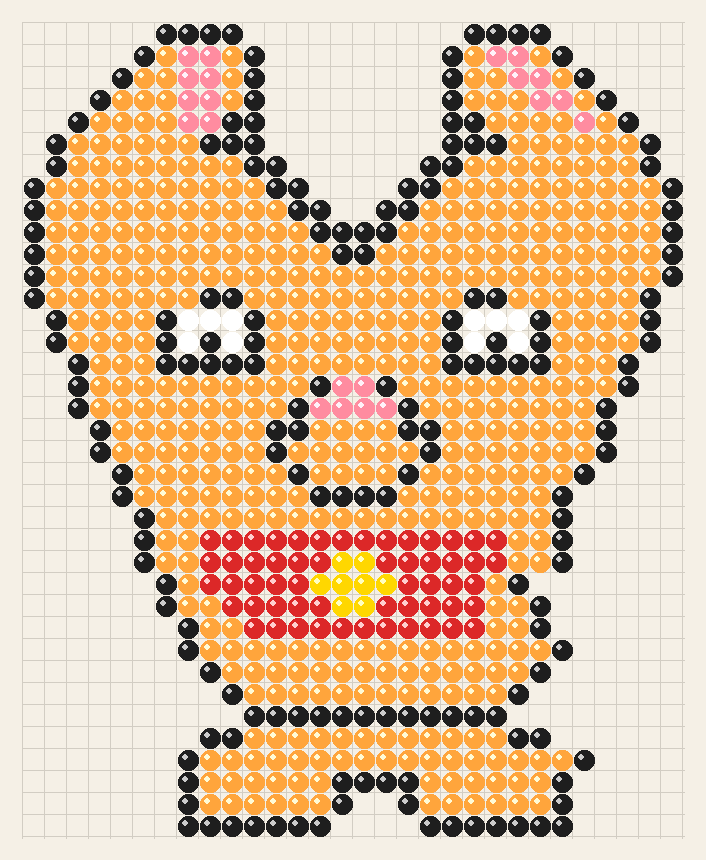

# 猫猫拼豆图生成器 🐱

生成可爱的猫猫拼豆图（像素风格）PNG 图片，可直接作为拼豆手工制作参考。

## 效果预览



## 使用方法

### 安装依赖

```bash
pip install Pillow
```

### 运行脚本

```bash
# 使用默认参数生成
python generate_cat_beads.py

# 自定义输出路径、珠子大小和间距
python generate_cat_beads.py --output my_cat.png --bead-size 25 --gap 3
```

### 参数说明

| 参数 | 缩写 | 默认值 | 说明 |
|------|------|--------|------|
| `--output` | `-o` | `cat_beads.png` | 输出图片路径 |
| `--bead-size` | `-s` | `20` | 每颗珠子的直径（像素） |
| `--gap` | `-g` | `2` | 珠子之间的间隔（像素） |

## 颜色对照表

| 符号 | 颜色 | 用途 |
|------|------|------|
| `B` | ⚫ 黑色 | 轮廓 / 眼睛 |
| `W` | ⚪ 白色 | 眼睛高光 |
| `O` | 🟠 橙色 | 橘猫主体 |
| `P` | 🩷 粉色 | 鼻子 / 耳内 |
| `Y` | 🟡 黄色 | 铃铛 |
| `R` | 🔴 红色 | 项圈 |

## 自定义图案

在 `generate_cat_beads.py` 中修改 `CAT_PATTERN` 矩阵即可自定义拼豆图案。每个字符代表一颗珠子，`.` 表示空白位置。
